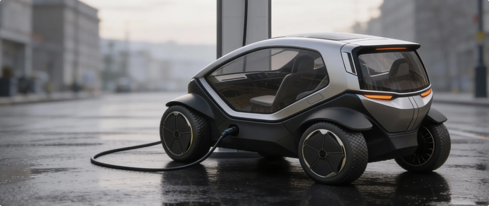
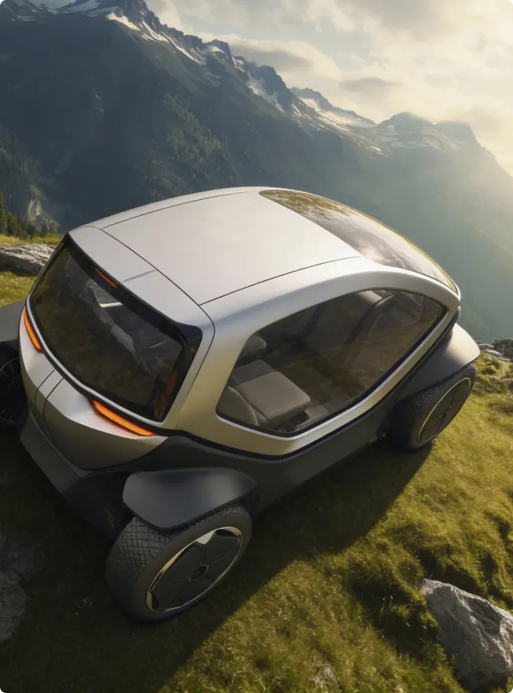
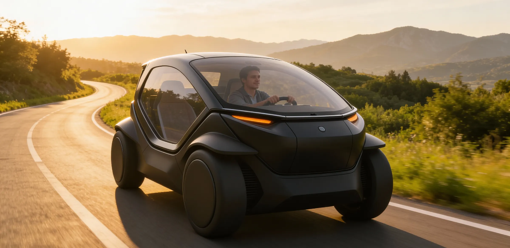
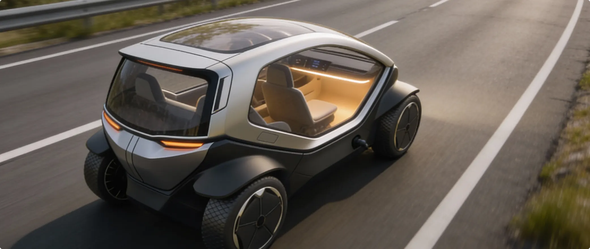
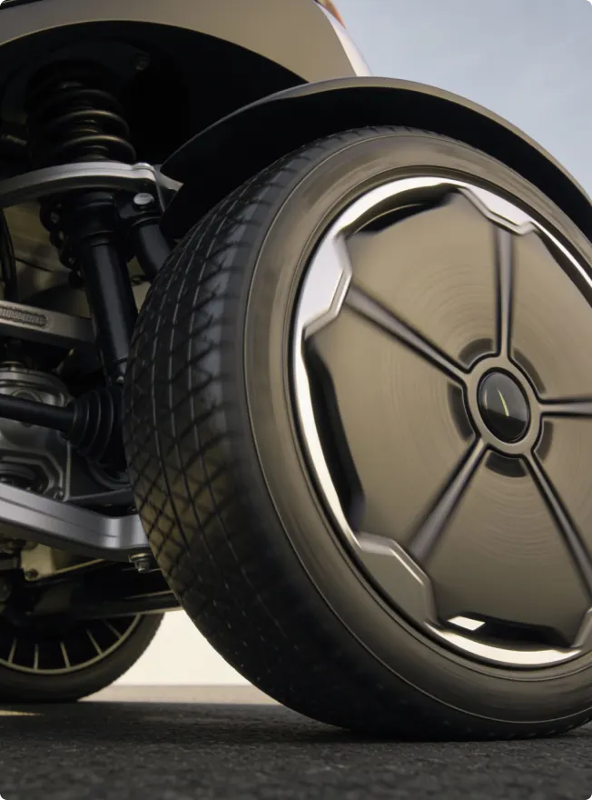

Electric cars are gaining momentum worldwide as governments, manufacturers, and
consumers push toward cleaner and more sustainable transportation.

With rising fuel costs and growing environmental concerns, electric vehicles are
no longer a niche option—they are becoming a practical choice for everyday
driving. Improved battery technology, expanded charging infrastructure, and
competitive pricing are accelerating this shift across global markets.

Automakers are also focusing on comfort, safety, and smart features, making
electric cars more appealing to families and urban commuters alike. As cities
invest in charging networks and supportive policies, experts predict electric
vehicles will play a central role in reducing emissions, easing congestion, and
shaping the future of mobility.

 

Beyond environmental benefits, electric cars are driving innovation across the
automotive industry.

Manufacturers are investing heavily in research and development to improve
driving range, reduce charging times, and enhance overall vehicle performance.
As a result, modern electric cars now offer smoother rides, quieter cabins, and
advanced driver-assistance features that rival—or surpass—traditional vehicles.

## The Rapid Growth of Electric Mobility

 

Infrastructure growth is another key factor supporting this transition. Cities
and highways are seeing a steady rise in public charging stations, while home
and workplace charging solutions are becoming more accessible. This growing
network is reducing range anxiety and making electric vehicles a realistic
option for both daily commutes and long-distance travel.
